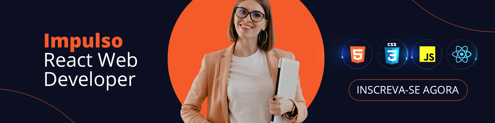

# DIO Impulso React Web Developer

  

### Bootcamp Impulso React Web Developer da Digital Innovation One

## 📚 Módulos

🔖 [IDE Instalação e Configuração (Visual Studio Code)]() 
## 🛠 Tecnologias Usadas
 

  
  
  
  